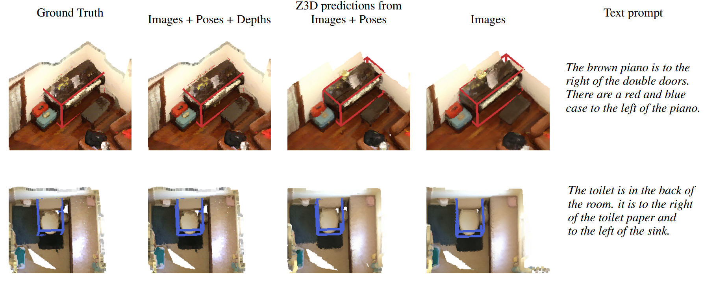
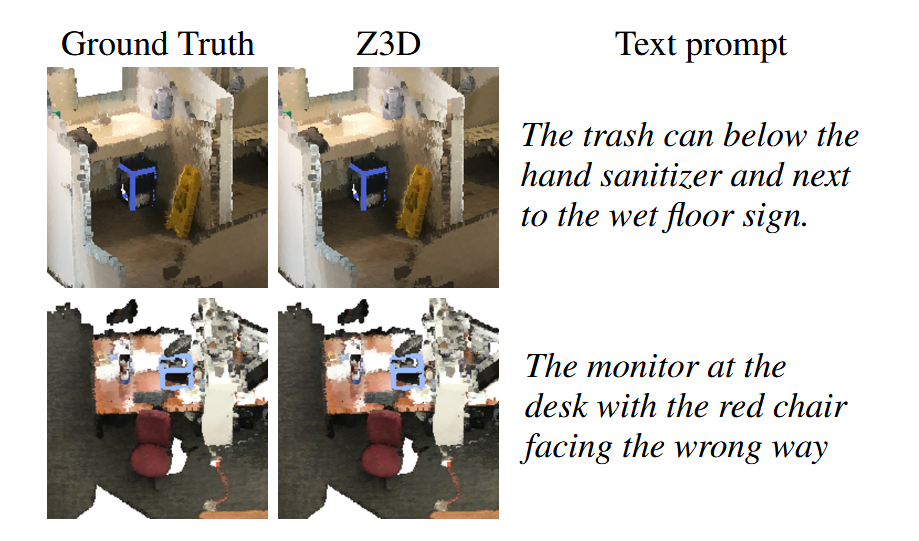

# Z3D: Zero-Shot 3D Visual Grounding from Images

This repository contains an implementation of Z3D, a zero-shot method for 3d visual grounding introduced in our paper:

> **Z3D: Zero-Shot 3D Visual Grounding from Images**<br>
> [Nikita Drozdov](https://github.com/anac0der),
> [Andrey Lemeshko](https://github.com/Andre7416),
> [Nikita Gavrilov](https://github.com/hadlosthands),
> [Anton Konushin](https://scholar.google.com/citations?user=ZT_k-wMAAAAJ),
> [Danila Rukhovich](https://github.com/filaPro),
> [Maksim Kolodiazhnyi](https://github.com/col14m)
> <br>
> https://arxiv.org/abs/2602.03361

## Installation
1. Create the new virtual environment:
```bash
python -m venv .
source ./bin/activate 
```
2. Install Pytorch with CUDA support:

```bash
pip install torch==2.7.0 torchvision torchaudio --index-url https://download.pytorch.org/whl/cu126
```
3. Install [SAM3](https://github.com/facebookresearch/sam3):
```bash
cd sam3
pip install -e .
cd ..
```
4. Install requirements for [LENS](https://github.com/hustvl/LENS):
```bash
cd lens
pip install -r requirements.txt
cd ..
```
5. Install additional dependencies:
```bash
pip install -r requirements.txt
```

### vLLM Server Setup

You also need to run a vLLM server to host the VLM agent. We recommend installing vLLM in a separate virtual environment to avoid dependency conflicts. Follow the official installation guide: https://docs.vllm.ai/en/latest/getting_started/installation/.

Our experiments were conducted with `vllm==0.11.0`.

## Data Preparation
Follow the instructions in the [./data](./data) folder to prepare the data.


## Weights
### SAM3
Please request access to the checkpoints via the SAM 3 Hugging Face [repository](https://huggingface.co/facebook/sam3). Once your request is approved, download the SAM3 checkpoint and save it to `./sam3/pretrained/sam3.pt`.

### LENS

Download weights for `LENS` from Hugging Face:
```bash
# RefCOCO pretrained weights
huggingface-cli download --resume-download OuyBin/LENS --local-dir ./pretrained/qwen2p5_refcoco

# Weights before ReasonSeg fine-tuning
huggingface-cli download --resume-download OuyBin/LENS_ReasonSeg --local-dir ./pretrained/qwen2p5_refcoco_1500step

# ReasonSeg fine-tuninh weights
huggingface-cli download --resume-download OuyBin/LENS_ReasonSeg_FT --local-dir ./pretrained/qwen2p5_reasonseg_ft

# ReasonSeg CoT weights
huggingface-cli download --resume-download OuyBin/LENS_ReasonSeg_CoT --local-dir ./pretrained/qwen2p5_reasonseg_cot
```

## Running 
Before running Z3D, start a VLM on a vLLM server. We use the following command for the 30B model:

```bash
vllm serve Qwen/Qwen3-VL-30B-A3B-Thinking \
  --tensor-parallel-size 2 \
  --allowed-local-media-path / \
  --port 8001 \
  --gpu-memory-utilization 0.95 \
  --no-enable-prefix-caching \
  --mm-processor-cache-gb 0
```

To run Z3D inference on ScanRefer, use the following command:

```bash
PYTHONPATH=./sam3 python run_scanrefer.py --config configs/z3d_qwen30b_scanrefer.yaml
```

For inference on Nr3D, run the following command:

```bash
PYTHONPATH=./sam3 python run_nr3d.py --config configs/z3d_qwen30b_nr3d.yaml
```

In this setup, method uses ground-truth point clouds and `Qwen/Qwen3-VL-30B-A3B-Thinking` model as VLM agent. We also provide configuration files for inference on point clouds [from posed images](./configs/z3d_qwen30b_scanrefer_subset250_posed.yaml), [from unposed images](./configs/z3d_qwen30b_scanrefer_subset250_unposed.yaml), as well as for [other VLM agents](./configs/z3d_qwen235b_scanrefer.yaml).

#### Replacing SAM3-Agent with LENS for faster segmentation

We also evaluated [LENS](https://github.com/hustvl/LENS) as segmentation backbone for Z3D. This model does not rely on a reasoning VLM and is therefore faster than SAM3-Agent. The segmentation backbone can be selected using the `seg_model` field in the onfiguration file. To run Z3D with LENS on the ScanRefer subset, use the following command:


```bash
PYTHONPATH=./lens python run_scanrefer.py --config configs/z3d_qwen30b_scanrefer_subset250_lens.yaml
```

## Metrics

### ScanRefer (with MC proposals)

| Modality | Unique Acc@0.25 | Unique Acc@0.50 | Multiple Acc@0.25 | Multiple Acc@0.50 | Overall Acc@0.25 | Overall Acc@0.50 |
|:--------:|:---------------:|:---------------:|:-----------------:|:-----------------:|:----------------:|:----------------:|
|[GT points clouds](./configs/z3d_qwen235b_scanrefer.yaml)| 73.9| 64.0 | 47.8 | 40.3 | 54.2 | 46.0 |
|[Posed RGB](./configs/z3d_qwen235b_scanrefer_posed.yaml)| 56.7| 32.0 | 38.4 | 22.6 | 42.8 | 24.8 |
|[Unposed RGB](./configs/z3d_qwen235b_scanrefer_unposed.yaml)|42.7| 21.9 | 27.5 | 10.1 | 31.2 | 12.9 |

### ScanRefer (with Mask3D proposals)
| Modality | Unique Acc@0.25 | Unique Acc@0.50 | Multiple Acc@0.25 | Multiple Acc@0.50 | Overall Acc@0.25 | Overall Acc@0.50 |
|:--------:|:---------------:|:---------------:|:-----------------:|:-----------------:|:----------------:|:----------------:|
|[GT points clouds](./configs/z3d_qwen235b_scanrefer_mask3d.yaml)|  82.7 | 74.9 | 52.8 | 47.0 | 60.0 | 53.7 |
### Nr3D
| Modality | Easy Acc. | Hard Acc. | View-dep. Acc. | View-indep. Acc. | Overall Acc. |
|:--------:|:---------------:|:---------------:|:-----------------:|:-----------------:|:----------------:|
|[GT points clouds](./configs/z3d_qwen235b_nr3d.yaml)| 62.6 | 47.5 | 50.7 | 57.1 | 54.8 |


## Predictions Example

### ScanRefer

<p float="left">
  
</p>

### Nr3D
<p float="left">
  
</p>

## Citation

If you find this work useful for your research, please cite our paper:

```
@article{drozdov2026z3d,
  title={Z3D: Zero-Shot 3D Visual Grounding from Images},
  author={Drozdov, Nikita and Lemeshko, Andrey and Gavrilov, Nikita and Konushin, Anton and Rukhovich, Danila and Kolodiazhnyi, Maksim},
  journal={arXiv preprint arXiv:2602.03361},
  year={2026}
}
```